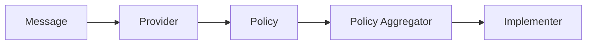

# Dynamic Control for OpenTelemetry .NET

| Status | |
| ------ | --- |
| Stability | [Development](../../README.md#Development) |
| Code Owners | [@stevejgordon](https://github.com/stevejgordon) |

[](https://www.nuget.org/packages/OpenTelemetry.DynamicControl)
[](https://www.nuget.org/packages/OpenTelemetry.DynamicControl)
[](https://app.codecov.io/gh/open-telemetry/opentelemetry-dotnet-contrib?flags[0]=unittests-DynamicControl)

> [!WARNING]
> This is an incubating feature. Breaking changes can happen on a new
> release without previous notice and without backward compatibility guarantees.

## Introduction

Dynamic Control for OpenTelemetry .NET is a library that provides the ability to
dynamically control the behavior of some specific features of the OpenTelemetry
SDK and instrumentation at runtime.

Current plans and progress are tracked in this
[meta issue](https://github.com/open-telemetry/opentelemetry-dotnet-contrib/issues/4742)

## Telemetry Policy

Dynamic control is implemented using
[Telemetry Policy OTEP](https://github.com/open-telemetry/opentelemetry-specification/blob/main/oteps/4738-telemetry-policy.md)
which is still being developed and is subject to change. An abstract outline of
dynamic control using telemetry policies is that there is a flow consisting of:

```text
Message -> Provider -> Policy -> Policy Aggregator -> Implementer
```



## Steps to use OpenTelemetry.DynamicControl

TODO

## Supported Features

TODO

## References

* [Telemetry Policy OTEP](https://github.com/open-telemetry/opentelemetry-specification/blob/main/oteps/4738-telemetry-policy.md)
