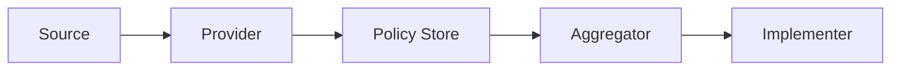

# Dynamic Control for OpenTelemetry .NET

| Status | |
| ------ | --- |
| Stability | [Development](../../README.md#Development) |
| Code Owners | [@stevejgordon](https://github.com/stevejgordon) |

> [!WARNING]
> This is an incubating feature. Breaking changes can happen on a new
> release without previous notice and without backward compatibility guarantees.

## Introduction

Dynamic Control for OpenTelemetry .NET is an experimental implementation of
runtime control based on telemetry policies. It is intended to help validate the
emerging OpenTelemetry design and is expected to evolve as that design matures.

Current plans and progress are tracked in this
[meta issue](https://github.com/open-telemetry/opentelemetry-dotnet-contrib/issues/4742).

## Current status

The package currently contains internal policy models (including a
trace sampling-rate proof of concept), source identity/metadata types, and a
copy-on-write policy store with immutable snapshots. It does not yet provide
public configuration APIs, policy sources, runtime policy application, or a
usable dynamic sampler.

The intended architecture is being developed incrementally:

```mermaid
flowchart LR
    Source --> Provider --> PolicyStore[Policy Store] --> Aggregator --> Implementer
```

The current sampling-rate model is deliberately a small Java-parity proof of
concept. It must not be interpreted as the final OpenTelemetry trace policy
shape described by the Telemetry Policy OTEP.

## References

* [Telemetry Policy OTEP](https://github.com/open-telemetry/opentelemetry-specification/blob/main/oteps/4738-telemetry-policy.md)
* [OpenTelemetry Java Contrib dynamic control](https://github.com/open-telemetry/opentelemetry-java-contrib/tree/main/dynamic-control)
